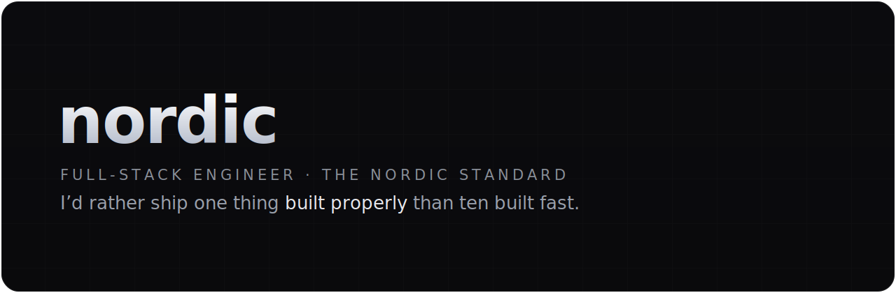

TypeScript · Swift · every repo follows the <a href="https://github.com/astronordic/.github">Nordic Standard</a>

---

Full-stack engineer. I build software end-to-end and obsess over the parts
you don't see — architecture, security, consistency — because that's where
products earn trust.

## Selected work

   
  Public — source-available. Safety-critical core, fully unit-tested.

   
  Private · live at trustlymm.com

   
  Private

## The standard

Every repo here follows the [Nordic Standard](https://github.com/astronordic/.github) — the full spec lives in [STANDARD.md](https://github.com/astronordic/.github/blob/main/STANDARD.md).

---

make it work → make it right → make it beautiful.

